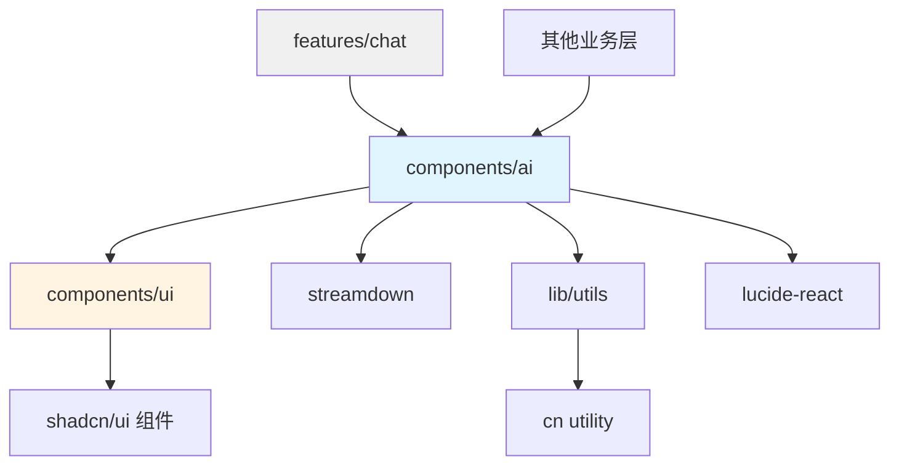

# AI 消息渲染系统设计文档

**日期：** 2026-03-04
**状态：** 设计阶段
**影响范围：** components/ai, components/ai-elements, features/chat

---

## 一、背景与问题

### 1.1 当前问题

1. **样式分散**
   - MessageResponse、ReasoningContent、TurnProcessSections 各自定义样式
   - Typography 样式重复（`text-[13px] leading-5`、`[&_li]:my-0.5` 等）
   - 行内代码样式在 `streamdown.css` 中硬编码

2. **字体大小不一致**
   - 消息文本：13px
   - 行内代码：14px（text-sm）
   - 紧凑文本：11px
   - 缺乏统一的 typography scale

3. **Whitespace 处理不当**
   - 之前的 `whitespace-pre-wrap` 修复导致普通列表间距过大
   - 纯文本目录树（ASCII art）没有正确换行
   - 缺少清晰的 whitespace 处理策略

4. **架构不清晰**
   - `ai-elements` 混合了基础组件和业务组件
   - 依赖关系不明确

### 1.2 设计目标

1. **统一样式系统** - 建立清晰的 typography scale 和组件样式
2. **架构清晰** - 创建独立的 `components/ai` 库，明确依赖关系
3. **可维护性** - 样式集中管理，易于主题切换和调试
4. **类型安全** - TypeScript 优先的样式配置

---

## 二、架构设计

### 2.1 目录结构

```
components/
├── ai/                          # 新的 AI 消息渲染库
│   ├── styles.ts                # 统一样式配置
│   ├── index.ts                 # 统一导出
│   ├── message.tsx              # 消息容器
│   ├── reasoning.tsx            # 思维链
│   ├── plan.tsx                 # 计划
│   ├── tool.tsx                 # 工具调用
│   ├── terminal.tsx             # 终端输出
│   ├── code-block.tsx           # 代码块
│   ├── runtime-code-surface.tsx # 运行时代码渲染
│   ├── streamdown-code.tsx      # Streamdown 代码组件
│   ├── streamdown-plugins.ts    # Streamdown 插件
│   ├── types.ts                 # 类型定义
│   └── README.md                # 使用文档
│
├── ai-elements/                 # 标记废弃，作为参考
│   └── ... (保留，不再维护)
│
└── ui/                          # shadcn/ui 基础组件
    └── ...
```

### 2.2 依赖关系



**依赖原则：**
- ✅ `components/ai` 只依赖基础 UI 层（ui, streamdown, lib）
- ✅ 不依赖业务层（features/chat）
- ✅ 可被任何业务层复用

---

## 三、样式系统设计

### 3.1 Typography Scale

**基础单位：** 12px（统一消息文本和行内代码）

| 名称 | 字体大小 | 行高 | 用途 |
|------|---------|------|------|
| `text.base` | 12px | 18px | 消息文本、普通段落 |
| `text.compact` | 11px | 14px | 紧凑模式、列表项 |
| `code.inline` | 12px | - | 行内代码 |
| `code.block` | 12px | 16px | 代码块文本 |

### 3.2 统一样式配置

**文件：** `components/ai/styles.ts`

```typescript
/**
 * AI 消息渲染统一样式配置
 */
export const CHAT_STYLES = {
  // 文本样式
  text: {
    /** 基础消息文本 - 12px */
    base: "text-[12px] leading-[18px] whitespace-normal",
    /** 紧凑文本 - 11px */
    compact: "text-[11px] leading-[14px]",
    /** 次要文本 */
    muted: "text-[12px] leading-[18px] text-muted-foreground",
  },

  // 代码样式
  code: {
    /** 行内代码 */
    inline: "rounded bg-muted px-1.5 py-0.5 font-mono text-[12px] leading-none",
    /** 代码块文本 */
    block: "font-mono text-[12px] leading-[16px] whitespace-pre-wrap",
  },

  // 容器样式
  container: {
    /** 代码块容器 */
    codeBlock: "llm-chat-runtime-surface border rounded-lg bg-muted/30",
    /** 过程容器 */
    process: "llm-chat-runtime-surface border rounded-lg bg-muted/30",
  },

  // 间距样式
  spacing: {
    /** 代码块内边距 */
    codePadding: "px-3 py-2",
    /** 列表间距 */
    listItem: "[&_li]:my-0.5 [&_ol]:my-1 [&_ul]:my-1",
  },
} as const;
```

### 3.3 CSS 变量系统

**文件：** `app/styles/theme.css`

```css
@theme {
  /* 聊天运行时色彩系统 */
  --chat-runtime-surface-bg: oklch(0.98 0.01 240);
  --chat-runtime-surface-border: oklch(0.90 0.02 240);
  --chat-runtime-surface-radius: 0.5rem;
  --chat-runtime-surface-text: oklch(0.20 0.02 240);
  --chat-runtime-surface-label: oklch(0.50 0.02 240);

  /* 代码块专用 */
  --chat-runtime-code-font-size: 12px;
  --chat-runtime-code-line-height: 16px;
  --chat-runtime-code-padding-x: 0.75rem;
  --chat-runtime-code-padding-y: 0.5rem;
}
```

---

## 四、组件设计规范

### 4.1 代码块组件

**设计模式：** 左上角类型标签 + 右侧复制按钮 + 隔一行后输出

**示例：**
```
┌─────────────────────────────────────┐
│ TYPESCRIPT              [复制按钮] │
├─────────────────────────────────────┤
│                                     │
│ const answer = 42;                  │
│                                     │
└─────────────────────────────────────┘
```

**实现要点：**
- 使用 `CHAT_STYLES.container.codeBlock`
- 头部：flex 布局，左侧语言标签（11px uppercase），右侧操作按钮
- 内容：`<pre>` 标签使用 `CHAT_STYLES.code.block`
- 间距：头部和内容之间有 border-b 分隔

### 4.2 过程组件（Reasoning/Plan/Tools/Terminal）

**设计模式：** 可折叠 + 文字 + Shimmer（流式）+ 默认折叠

**示例：**
```
🧠 [Shimmer: Thinking...] ▼

展开后：
┌─────────────────────────────────────┐
│ 🧠 Thought for 3s            [▼]  │
├─────────────────────────────────────┤
│                                     │
│ 分析问题...                          │
│ 代码结构如下...                      │
│                                     │
└─────────────────────────────────────┘
```

**实现要点：**
- 使用 `Collapsible` 组件，`defaultOpen={false}`
- 触发器：`PROCESS_STYLES.trigger`（12px 文本，muted 颜色）
- 流式状态：`Shimmer` 组件包裹文本
- 内容区：`PROCESS_STYLES.content` + `CHAT_STYLES.text.base`

---

## 五、Whitespace 处理策略

### 5.1 CSS 作用域分层

**基础原则：**
- 普通文本：`whitespace-normal` - 标准 Markdown 渲染
- 代码块：`whitespace-pre-wrap` - 保留所有空白和换行
- 行内代码：`whitespace-normal` - 由 `<code>` 标签处理

**实现：**
```css
@layer components {
  /* 基础文本：Markdown 标准行为 */
  .chat-text {
    white-space: normal;
  }

  /* 代码块：保留所有空白 */
  .chat-text pre,
  .chat-text code {
    white-space: pre-wrap;
  }
}
```

### 5.2 Prompt 引导策略

在 System Prompt 中添加格式要求：

```
所有代码、目录树、命令行输出必须使用代码块包裹：
- 代码：```typescript / ```python / ```rust 等
- 目录树：```text 或 ```bash
- 终端输出：```bash 或 ```shell-session
```

**理由：**
- 源头规范，减少前端复杂度
- LLM 通常会遵守格式要求
- 代码块自动获得正确的 whitespace 处理

---

## 六、迁移计划

### 6.1 迁移范围

**从 `ai-elements` 迁移到 `ai`：**

| 源文件 | 目标文件 | 状态 |
|--------|---------|------|
| `message.tsx` | `components/ai/message.tsx` | 待迁移 |
| `reasoning.tsx` | `components/ai/reasoning.tsx` | 待迁移 |
| `plan.tsx` | `components/ai/plan.tsx` | 待迁移 |
| `tool.tsx` | `components/ai/tool.tsx` | 待迁移 |
| `terminal.tsx` | `components/ai/terminal.tsx` | 待迁移 |
| `code-block.tsx` | `components/ai/code-block.tsx` | 待迁移 |
| `runtime-code-surface.tsx` | `components/ai/runtime-code-surface.tsx` | 待迁移 |
| `streamdown-code.tsx` | `components/ai/streamdown-code.tsx` | 待迁移 |
| `streamdown-plugins.ts` | `components/ai/streamdown-plugins.ts` | 待迁移 |

**保留在 `ai-elements`：**
- 其他业务无关的基础组件
- 标记为 `@deprecated`，添加迁移说明

### 6.2 引用更新

需要更新的业务层文件：
- `features/chat/conversation-view.tsx`
- `features/chat/agent-turn-card.tsx`
- `features/chat/turn-process-sections.tsx`

**更新策略：**
```tsx
// 旧引用
import { MessageResponse } from "@/components/ai-elements/message";

// 新引用
import { MessageResponse } from "@/components/ai/message";
```

### 6.3 废弃标记

在 `ai-elements` 的迁移文件中添加：

```tsx
/**
 * @deprecated 已迁移到 components/ai/message.tsx
 * 请使用 import { MessageResponse } from "@/components/ai/message"
 * 此文件将在下个版本移除
 */
```

---

## 七、实现步骤

### Phase 1: 基础设施（1-2 小时）
1. 创建 `components/ai/` 目录结构
2. 实现 `styles.ts` 样式配置
3. 更新 `app/styles/theme.css` CSS 变量
4. 创建 `types.ts` 类型定义

### Phase 2: 核心组件迁移（2-3 小时）
1. 迁移 `message.tsx`，应用新样式
2. 迁移 `streamdown-code.tsx`，统一行内代码样式
3. 迁移 `runtime-code-surface.tsx`，应用代码块规范
4. 迁移 `streamdown-plugins.ts`

### Phase 3: 过程组件迁移（2-3 小时）
1. 迁移 `reasoning.tsx`
2. 迁移 `plan.tsx`
3. 迁移 `tool.tsx`
4. 迁移 `terminal.tsx`

### Phase 4: 业务层更新（1-2 小时）
1. 更新 `features/chat/` 中的引用
2. 测试所有聊天场景
3. 回归测试

### Phase 5: 废弃处理（0.5 小时）
1. 在 `ai-elements` 添加 `@deprecated` 标记
2. 更新文档
3. 清理未使用的代码

**总工作量：** 6-10 小时

---

## 八、测试策略

### 8.1 功能测试

**测试场景：**
- ✅ 普通文本消息（段落、列表、标题）
- ✅ 行内代码渲染
- ✅ 代码块渲染（带语言标签和复制按钮）
- ✅ 目录树渲染（用 ```text 包裹）
- ✅ Reasoning 折叠/展开
- ✅ Plan 渲染
- ✅ Tool 调用展示
- ✅ Terminal 输出

### 8.2 视觉回归测试

**关键检查点：**
- Typography 一致性（所有文本 12px）
- 间距统一（列表、段落、代码块）
- 代码块布局（类型标签 + 复制按钮）
- Whitespace 处理（换行、缩进）

### 8.3 边缘情况

- 超长代码行（自动换行）
- 嵌套列表
- 混合内容（文本 + 代码 + 列表）
- 流式渲染（Shimmer 动画）

---

## 九、风险与缓解

### 9.1 风险

1. **回归风险** - 迁移可能破坏现有功能
   - 缓解：完整的测试覆盖，逐步迁移

2. **样式冲突** - 新旧样式可能冲突
   - 缓解：使用不同的 CSS 类名前缀

3. **性能影响** - Tailwind 组件类可能影响构建大小
   - 缓解：使用 PurgeCSS，监控 bundle 大小

### 9.2 回滚策略

如果迁移失败：
1. 保留 `ai-elements` 作为备份
2. 业务层可以快速切回旧引用
3. 使用 Git 标签标记迁移前状态

---

## 十、成功标准

### 10.1 功能完整性
- ✅ 所有现有功能正常工作
- ✅ 无视觉回归
- ✅ 性能无明显下降

### 10.2 代码质量
- ✅ 样式集中在 `styles.ts`
- ✅ 依赖关系清晰
- ✅ 类型安全（TypeScript）

### 10.3 可维护性
- ✅ 文档完整（README + 注释）
- ✅ 示例代码
- ✅ 废弃标记清晰

---

## 十一、后续优化

### 11.1 短期（1-2 周）
- 收集用户反馈
- 修复边缘情况 bug
- 优化 Prompt 引导策略

### 11.2 中期（1-2 月）
- 添加主题切换支持（亮色/暗色/自定义）
- 支持自定义样式变体
- 性能优化（虚拟滚动等）

### 11.3 长期（3-6 月）
- AI 驱动的内容识别（自动检测目录树等）
- 交互式代码块（运行、编辑）
- 多模态内容支持（图片、图表）

---

## 附录 A：现有风格总结

### 代码块风格
- **左上角**：类型标签（11px uppercase muted）
- **右侧**：操作按钮（复制、下载等）
- **内容**：隔一行后输出，使用等宽字体

### 过程组件风格
- **可折叠**：默认折叠状态
- **触发器**：图标 + 文字（12px muted）
- **流式状态**：文字 + Shimmer 动画
- **内容**：展开后显示详细内容

### Typography 风格
- **统一字体大小**：12px（消息文本、行内代码）
- **紧凑模式**：11px（列表项、标签）
- **代码**：等宽字体，12px，16px 行高

---

## 附录 B：参考资源

- [Tailwind CSS v4 文档](https://tailwindcss.com/docs)
- [Streamdown 文档](https://streamdown.dev)
- [shadcn/ui 设计系统](https://ui.shadcn.com)
- [GitHub Markdown 渲染](https://github.com)
