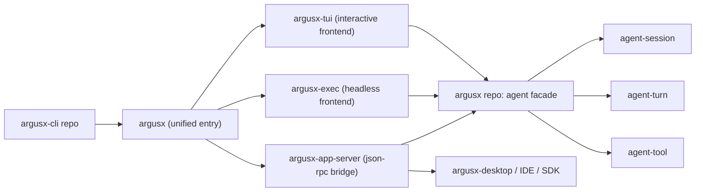

# 基于 Codex 前端 CLI 的 ArgusX 设计文档

**日期**: 2026-02-24  
**状态**: Draft（待评审，已按独立仓策略更新）  
**作者**: Codex

## 1. 背景与目标

当前 `argusx` 已有多个 CLI：

- `agent-cli`：Ratatui 交互聊天（单 session）。
- `agent-turn-cli`：流式调试 CLI（偏开发测试）。
- `agent-session-cli`：session create/list。
- `llm-cli`、`prompt_lab_cli`：独立能力入口。

这些入口能力分散、参数风格不统一、缺少统一“前端 CLI 层”的协议与配置抽象。  
本设计基于 `.vendor/codex` 的实现，给出一套适配 `argusx` 的统一前端 CLI 方案。

目标：

1. 统一 CLI 入口与参数体系，保留现有子工具能力。
2. 提供三种前端面：交互 TUI、非交互 Exec、桌面/IDE 桥接 App Server。
3. 复用现有 `agent` facade，不重写核心推理/工具执行逻辑。
4. 保持渐进迁移，不中断已有 `agent-cli`/`agent-turn-cli` 使用方式。
5. 将 CLI 前端工程独立到单独仓库 `argusx-cli`，与主仓 `argusx` 解耦迭代。

## 1.1 仓库策略更新（2026-02-24）

本设计已从“在 `argusx` 单仓内演进”调整为“**独立仓实现**”：

- 新仓路径：`/Users/wanyaozhong/projects/argusx-cli`
- 主仓 `argusx`：保留 `agent` runtime、桌面端集成点和兼容入口
- 新仓 `argusx-cli`：承载统一 CLI 入口、TUI/Exec/App Server 前端层、CLI 协议与参数系统

这样可以降低 CLI 重构对主业务仓的干扰，并允许 CLI 独立发布节奏。

## 2. 调研范围（Codex）

本次主要调研以下实现文件：

- 分发与启动：
  - `.vendor/codex/codex-cli/bin/codex.js`
  - `.vendor/codex/codex-cli/package.json`
- 统一 CLI 路由：
  - `.vendor/codex/codex-rs/cli/src/main.rs`
  - `.vendor/codex/codex-rs/arg0/src/lib.rs`
- 前端交互层：
  - `.vendor/codex/codex-rs/tui/src/cli.rs`
  - `.vendor/codex/codex-rs/tui/src/lib.rs`
  - `.vendor/codex/codex-rs/tui/src/app.rs`
  - `.vendor/codex/codex-rs/tui/src/app_event.rs`
- 非交互层：
  - `.vendor/codex/codex-rs/exec/src/cli.rs`
  - `.vendor/codex/codex-rs/exec/src/lib.rs`
- 桥接协议层：
  - `.vendor/codex/codex-rs/app-server/README.md`
  - `.vendor/codex/codex-rs/app-server/src/lib.rs`
- SDK 封装层：
  - `.vendor/codex/sdk/typescript/src/exec.ts`
  - `.vendor/codex/sdk/typescript/src/thread.ts`

## 3. Codex 前端 CLI 的关键实现模式

### 3.1 分发与启动分层

Codex 用 `Node launcher + native binary` 双层模型：

1. `codex.js` 根据 OS/ARCH 映射 target triple。
2. 解析平台包中的 native binary（找不到则回退本地 vendor）。
3. 只做进程转发与信号传递，不承载业务逻辑。

结论：分发层与业务层完全解耦，CLI 业务都在 Rust。

### 3.2 统一入口（Multitool CLI）

`codex-rs/cli/src/main.rs` 将多个前端面整合为一个总入口：

- 默认无子命令：进入 TUI。
- `exec`：非交互。
- `review`：审查模式。
- `mcp`/`mcp-server`、`app-server`、`completion`、`resume`、`fork` 等。

核心点：

1. `clap(flatten)` 复用一套基础参数（model/sandbox/approval/profile/config）。
2. 根级配置可被子命令继承并覆盖（`prepend_config_flags`）。
3. 交互入口与非交互入口共享配置解析路径。

### 3.3 配置覆盖模型

`codex-rs/utils/cli/src/config_override.rs` 提供了可复用模式：

- 统一 `-c/--config key=value` 入口。
- value 先按 TOML 解析，失败时回落字符串。
- 支持 dotted path 深层覆盖。

结论：CLI 参数无需无限扩展，通过 `-c` 可以承接高级配置。

### 3.4 交互前端（TUI）架构

`tui` 层不是“仅渲染”，而是完整前端状态机：

1. `run_main` 负责配置、登录约束、恢复/分叉会话、终端初始化。
2. `App::run` 作为总事件循环，统一处理 UI 事件、线程事件、异步任务事件。
3. `AppEvent` 是强类型事件总线，覆盖模型切换、权限弹层、技能管理、会话切换等 UI 行为。

结论：TUI 不是单一页面组件，而是“前端应用内核”。

### 3.5 非交互前端（Exec）

`exec` 与 TUI 共享核心配置抽象，但输出策略分离：

- 人类可读输出模式。
- JSONL 事件输出模式（便于 SDK/自动化消费）。

结论：面向“人”和“程序”输出格式分开，减少耦合。

### 3.6 富前端桥接（App Server）

`app-server` 提供 JSON-RPC 双向协议，支持：

- thread / turn / item 三层模型。
- stdio 与 websocket（ws 当前标注 experimental）。
- 事件通知流与命令请求分离。

结论：桌面端/IDE 不应直接绑 TUI；应通过稳定协议对接 runtime。

### 3.7 SDK 作为“前端适配器”

TS SDK 的本质是：

1. spawn `codex exec --experimental-json`。
2. 读取 stdout JSONL 流。
3. 封装成 thread.run()/runStreamed() 高层 API。

结论：SDK 不复制业务，仅做协议适配与开发者体验封装。

## 4. ArgusX 现状对照

### 4.1 已有基础

- `agent` facade 已统一 `chat/chat_stream/session` 能力（`agent/src/agent.rs`）。
- `agent-cli` 已有基础 Ratatui 聊天前端（`agent-cli/src/event_loop.rs`）。
- `agent-session` 已有文件化 session/turn 存储（`agent-session/src/storage.rs`）。
- `argusx-desktop` 已有 Tauri IPC 通道（`argusx-desktop/src-tauri/src/lib.rs`）。

### 4.2 主要差距

1. 缺统一总入口，多个 CLI 并列且参数语义不一致。
2. 缺共享配置覆盖层（无统一 `-c key=value`）。
3. 交互前端仍是“单 loop + 简单 state”，尚未形成可扩展事件总线。
4. 桌面端暂无通用 agent 协议桥（目前主要是 PromptLab 业务命令）。
5. 无对外稳定 JSONL / JSON-RPC 协议面，难以支持 IDE/SDK 扩展。

## 5. 设计方案（结合 ArgusX）

### 5.1 目标架构

### 5.2 核心设计决策

#### 决策 A：在独立仓新增统一入口（仓名 `argusx-cli`，二进制名 `argusx`）

子命令建议：

- `argusx`（默认）=> TUI
- `argusx exec` => 非交互
- `argusx resume` => 恢复会话
- `argusx session` => 兼容现有 session 管理
- `argusx app-server` => 桥接模式

兼容策略：

- `agent-cli`/`agent-turn-cli`/`agent-session-cli` 保留一段时间，内部逐步代理到新入口。
- 新入口代码优先在独立仓维护，主仓仅保留最小兼容和调用链路。

#### 决策 B：抽取 `argusx-utils-cli` 共享参数与覆盖能力

抽象内容：

- `CliConfigOverrides`（`-c key=value`）。
- `SandboxModeCliArg` / `ApprovalModeCliArg`（先定义枚举与默认值策略，可先软实现）。
- 根参数与子命令参数合并规则（借鉴 Codex 的 prepend/override 语义）。

#### 决策 C：定义统一事件协议（先 JSONL，再 JSON-RPC）

先落地可执行的 JSONL 事件格式（exec 输出）：

- `thread.started`
- `turn.started`
- `item.delta`
- `item.completed`
- `turn.completed`
- `turn.failed`

后续在 app-server 层封装为 JSON-RPC method + params，避免直接暴露内部 Rust 枚举。

#### 决策 D：为桌面端建设 `argusx-app-server`

目的：让 `argusx-desktop` 从“直接调用 PromptLab 命令”扩展到“可驱动 agent thread/turn”。

接口最小集（MVP）：

1. `initialize`
2. `thread/start`
3. `thread/resume`
4. `thread/list`
5. `turn/start`
6. `turn/interrupt`

传输先做 `stdio://`（最稳定），`ws://` 后置到实验特性。

#### 决策 E：TUI 从“页面循环”演进到“事件总线”

参考 Codex 的 `AppEvent` 模式，分离：

- 输入事件（键盘/命令）。
- 运行时事件（chat_stream）。
- UI 控制事件（弹层、切换、状态条、恢复/分叉）。

保留当前 `agent-cli` 已有能力（reasoning 折叠、tool progress），逐步增强：

1. resume picker（当前仅 `--session`）。
2. status line（session/model/turn state）。
3. 多线程安全退出与终端恢复保证。

## 6. 分阶段实施计划

### Phase 1：独立仓落地（`argusx-cli`）

交付：

- 在新仓创建 `argusx` 统一入口二进制。
- 在新仓创建 `argusx-utils-cli`（配置覆盖与公共参数）。
- 在新仓提供 `exec` 子命令和稳定 JSONL 输出。
- 在主仓记录集成路径与迁移说明。

验收：

- `cargo run -p argusx-cli -- --help` 包含统一子命令。
- `argusx exec --json` 输出可机读 JSONL。

### Phase 2：TUI 前端内核升级（主要在 `argusx-cli` 仓）

交付：

- 事件总线化 App 循环。
- resume picker + `--last` 支持。
- 更完整 turn 状态与错误恢复。

验收：

- `agent-cli` 现有测试通过。
- 新增 TUI 事件/状态测试通过（无 panic，无 raw mode 泄漏）。

### Phase 3：App Server 与桌面桥接（跨仓协作）

交付：

- 新仓提供 `argusx app-server`（stdio JSON-RPC）。
- 主仓 `argusx-desktop` 增加 agent thread/turn 对接 API。

验收：

- 桌面端可创建会话并流式接收 turn 事件。
- 断开重连后可通过 `thread/resume` 恢复上下文。

### Phase 4：兼容收口与文档化（主仓 + 新仓）

交付：

- 旧 CLI 保留 alias/迁移提示。
- 输出协议、命令规范、配置规范文档。

验收：

- 迁移前后核心功能一致。
- 无破坏性变更（默认路径）。

## 7. 风险与缓解

1. **风险：一次性重构过大导致 CLI 不稳定。**  
缓解：严格按 phase 切分，先统一入口与协议，再升级 TUI 和 app-server。

2. **风险：桌面端直接耦合 runtime 内部类型。**  
缓解：必须通过 app-server 协议层隔离，不直接 expose Rust 内部事件枚举。

3. **风险：参数爆炸与兼容困难。**  
缓解：公共参数放 `argusx-utils-cli`，高级项统一走 `-c key=value`。

4. **风险：会话恢复语义不一致。**  
缓解：统一以 `session_id + turn history` 为基准，先完成 resume，再评估 fork。

## 8. 非目标（本设计不做）

1. 不在本轮引入新的持久化后端（例如 SQLite 替换现有 session 存储）。
2. 不在本轮实现完整 MCP 生态管理命令。
3. 不在本轮重写 PromptLab 业务链路。

## 9. 最终建议

建议采用 “**独立仓承载 CLI + 协议先行 + 前端分层**” 的 Codex 化路径：

1. 先把 `argusx` 的 CLI 从“多个工具”升级为“一个前端平台”。
2. 通过 JSONL/JSON-RPC 建立可复用协议面。
3. 在不破坏现有 `agent`/`agent-session` 的前提下逐步增强交互体验和桌面联动。

这条路径对现有代码侵入最小，且能直接支撑后续 IDE/桌面/自动化多前端扩展。
