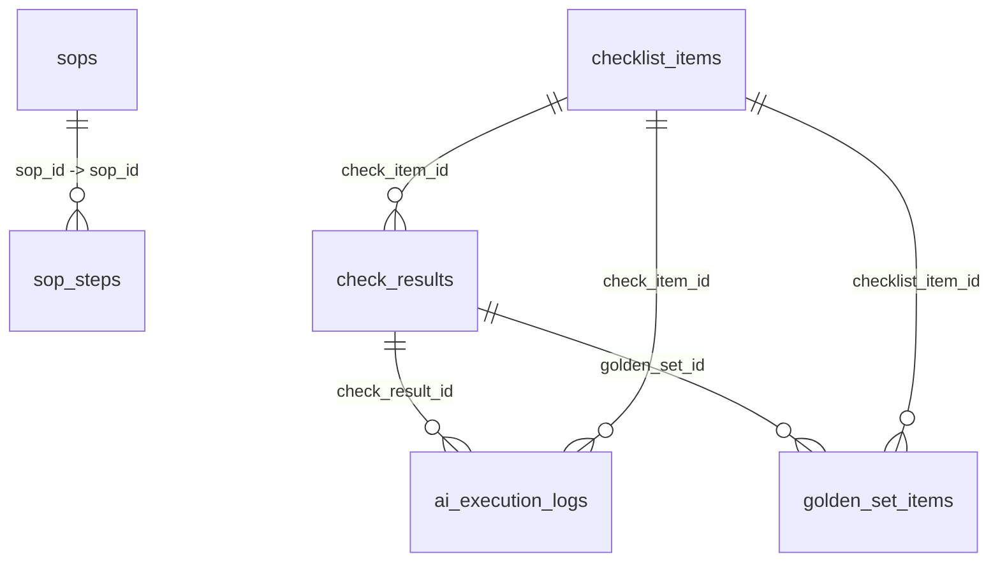

# Prompt Lab 全量重写设计（SQL-First）

日期：2026-02-25  
范围：`prompt_lab_core` + Tauri 命令层 + 前端 API 契约  
原则：不考虑兼容与迁移，直接以新契约重写

## 1. 目标与关键决策

1. 统一 Prompt Lab 的 SOP、Checklist、CheckResult、AI 日志与 Golden Set 数据模型。
2. 数据库层以 SQL 契约为唯一源头（SQL-First）。
3. `sop_steps` 为步骤真源；`sops.detect/handle/verification/rollback` 存步骤引用快照。
4. `check_results` 支持三种写入行为：
   - AI：追加历史；
   - Manual + `check_item_id IS NULL`：追加历史；
   - Manual + `check_item_id IS NOT NULL`：同键仅保留人工最新。
5. Golden Set 允许使用 AI 或 Manual 的 `check_results` 记录作为主记录来源。

## 2. 数据库定义（DDL）

```sql
PRAGMA foreign_keys = ON;

-- ============================================================================
-- 模块一：SOP Core Domain
-- ============================================================================

CREATE TABLE IF NOT EXISTS sops (
  id INTEGER PRIMARY KEY AUTOINCREMENT,
  sop_id TEXT NOT NULL UNIQUE,
  name TEXT NOT NULL,
  ticket_id TEXT,
  version INTEGER NOT NULL DEFAULT 1,
  detect TEXT CHECK (detect IS NULL OR json_valid(detect)),
  handle TEXT CHECK (handle IS NULL OR json_valid(handle)),
  verification TEXT CHECK (verification IS NULL OR json_valid(verification)),
  rollback TEXT CHECK (rollback IS NULL OR json_valid(rollback)),
  status TEXT NOT NULL DEFAULT 'active'
    CHECK (status IN ('active', 'inactive', 'draft')),
  created_at INTEGER NOT NULL,
  updated_at INTEGER NOT NULL
);

CREATE INDEX idx_sops_status ON sops(status);
CREATE INDEX idx_sops_ticket ON sops(ticket_id);

CREATE TABLE IF NOT EXISTS sop_steps (
  id INTEGER PRIMARY KEY AUTOINCREMENT,
  sop_id TEXT NOT NULL,
  name TEXT NOT NULL,
  version INTEGER NOT NULL DEFAULT 1,
  operation TEXT,
  verification TEXT,
  impact_analysis TEXT,
  rollback TEXT,
  created_at INTEGER NOT NULL,
  updated_at INTEGER NOT NULL,
  FOREIGN KEY (sop_id) REFERENCES sops(sop_id)
);

CREATE INDEX idx_sop_steps_sop ON sop_steps(sop_id);

-- ============================================================================
-- 模块二：AI Check Engine Domain
-- ============================================================================

CREATE TABLE IF NOT EXISTS checklist_items (
  id INTEGER PRIMARY KEY AUTOINCREMENT,
  name TEXT NOT NULL,
  prompt TEXT NOT NULL,
  temperature REAL DEFAULT 0.0,
  context_type TEXT NOT NULL
    CHECK (context_type IN (
      'sop', 'sop_procedure_detect', 'sop_procedure_handle',
      'sop_procedure_verification', 'sop_procedure_rollback',
      'sop_step_operation', 'sop_step_verification',
      'sop_step_impact_analysis', 'sop_step_rollback', 'sop_step_common'
    )),
  result_schema TEXT CHECK (result_schema IS NULL OR json_valid(result_schema)),
  version INTEGER NOT NULL DEFAULT 1,
  status TEXT NOT NULL DEFAULT 'active'
    CHECK (status IN ('active', 'inactive', 'draft')),
  created_at INTEGER NOT NULL,
  updated_at INTEGER NOT NULL,
  deleted_at INTEGER
);

CREATE INDEX idx_checklist_status ON checklist_items(status);
CREATE INDEX idx_checklist_context_type ON checklist_items(context_type);

CREATE TABLE IF NOT EXISTS check_results (
  id INTEGER PRIMARY KEY AUTOINCREMENT,
  context_type TEXT NOT NULL,
  context_key TEXT NOT NULL,
  check_item_id INTEGER,
  source_type INTEGER NOT NULL DEFAULT 1 CHECK (source_type IN (1, 2)),
  operator_id TEXT,
  result TEXT CHECK (result IS NULL OR json_valid(result)),
  is_pass INTEGER NOT NULL DEFAULT 0 CHECK (is_pass IN (0, 1)),
  created_at INTEGER NOT NULL,
  FOREIGN KEY (check_item_id) REFERENCES checklist_items(id)
);

CREATE INDEX idx_check_results_item ON check_results(check_item_id);
CREATE INDEX idx_check_results_context ON check_results(context_type, context_key);

CREATE UNIQUE INDEX idx_check_results_manual_latest
ON check_results (context_type, context_key, check_item_id)
WHERE source_type = 2 AND check_item_id IS NOT NULL;

CREATE TABLE IF NOT EXISTS ai_execution_logs (
  id INTEGER PRIMARY KEY AUTOINCREMENT,
  check_result_id INTEGER,
  context_type TEXT NOT NULL,
  context_key TEXT NOT NULL,
  check_item_id INTEGER NOT NULL,
  model_provider TEXT,
  model_version TEXT NOT NULL,
  temperature REAL DEFAULT 0.0,
  prompt_snapshot TEXT,
  raw_output TEXT,
  input_tokens INTEGER NOT NULL DEFAULT 0,
  output_tokens INTEGER NOT NULL DEFAULT 0,
  exec_status INTEGER NOT NULL DEFAULT 0 CHECK (exec_status IN (0, 1, 2, 3)),
  error_message TEXT,
  latency_ms INTEGER NOT NULL DEFAULT 0,
  created_at INTEGER NOT NULL,
  FOREIGN KEY (check_result_id) REFERENCES check_results(id),
  FOREIGN KEY (check_item_id) REFERENCES checklist_items(id)
);

CREATE INDEX idx_ai_logs_item ON ai_execution_logs(check_item_id);
CREATE INDEX idx_ai_logs_context ON ai_execution_logs(context_type, context_key);

CREATE TABLE IF NOT EXISTS golden_set_items (
  golden_set_id INTEGER NOT NULL,
  checklist_item_id INTEGER NOT NULL,
  sort_order INTEGER NOT NULL DEFAULT 0,
  created_at TEXT NOT NULL DEFAULT (strftime('%Y-%m-%dT%H:%M:%fZ', 'now')),
  PRIMARY KEY (golden_set_id, checklist_item_id),
  FOREIGN KEY (golden_set_id) REFERENCES check_results(id),
  FOREIGN KEY (checklist_item_id) REFERENCES checklist_items(id)
);

CREATE INDEX idx_gsi_item ON golden_set_items(checklist_item_id);
```

## 3. 数据库关系



补充说明：
1. `sops.detect/handle/verification/rollback` 不建立外键，存 JSON 引用快照（结构见第 4 节）。
2. `golden_set_items.golden_set_id` 指向 `check_results.id`，允许选择 AI 或 Manual 记录。

## 4. Domain 数据定义

### 4.1 枚举

```rust
enum ChecklistStatus { Active, Inactive, Draft }
enum SopStatus { Active, Inactive, Draft }
enum SourceType { Ai = 1, Manual = 2 }
enum ExecStatus { Pending = 0, Success = 1, ApiError = 2, ParseFailed = 3 }

enum ChecklistContextType {
    Sop,
    SopProcedureDetect,
    SopProcedureHandle,
    SopProcedureVerification,
    SopProcedureRollback,
    SopStepOperation,
    SopStepVerification,
    SopStepImpactAnalysis,
    SopStepRollback,
    SopStepCommon,
}
```

### 4.2 核心实体

```rust
struct Sop {
    id: i64,
    sop_id: String,
    name: String,
    ticket_id: Option<String>,
    version: i64,
    detect: Option<Vec<SopStepRef>>,
    handle: Option<Vec<SopStepRef>>,
    verification: Option<Vec<SopStepRef>>,
    rollback: Option<Vec<SopStepRef>>,
    status: SopStatus,
    created_at: i64,
    updated_at: i64,
}

struct SopStepRef {
    sop_step_id: i64,
    name: String,
}

struct SopStep {
    id: i64,
    sop_id: String,
    name: String,
    version: i64,
    operation: Option<serde_json::Value>,
    verification: Option<serde_json::Value>,
    impact_analysis: Option<serde_json::Value>,
    rollback: Option<serde_json::Value>,
    created_at: i64,
    updated_at: i64,
}

struct SopAggregate {
    sop: Sop,
    detect_steps: Vec<SopStep>,
    handle_steps: Vec<SopStep>,
    verification_steps: Vec<SopStep>,
    rollback_steps: Vec<SopStep>,
}

struct ChecklistItem {
    id: i64,
    name: String,
    prompt: String,
    temperature: f64,
    context_type: ChecklistContextType,
    result_schema: Option<serde_json::Value>,
    version: i64,
    status: ChecklistStatus,
    created_at: i64,
    updated_at: i64,
    deleted_at: Option<i64>,
}

struct CheckResult {
    id: i64,
    context_type: String,
    context_key: String,
    check_item_id: Option<i64>,
    source_type: SourceType,
    operator_id: Option<String>,
    result: Option<serde_json::Value>,
    is_pass: bool,
    created_at: i64,
}

struct AiExecutionLog {
    id: i64,
    check_result_id: Option<i64>,
    context_type: String,
    context_key: String,
    check_item_id: i64,
    model_provider: Option<String>,
    model_version: String,
    temperature: f64,
    prompt_snapshot: Option<String>,
    raw_output: Option<String>,
    input_tokens: i64,
    output_tokens: i64,
    exec_status: ExecStatus,
    error_message: Option<String>,
    latency_ms: i64,
    created_at: i64,
}

struct GoldenSetItem {
    golden_set_id: i64,
    checklist_item_id: i64,
    sort_order: i64,
    created_at: String,
}
```

## 5. SOP 阶段引用规则

1. `sops.detect/handle/verification/rollback` 的 JSON 结构固定为：
   ```json
   [{"sop_step_id": 123, "name": "Step Name"}]
   ```
2. `sop_steps` 为真源；读取 `SopAggregate` 时按引用顺序聚合完整 `SopStep`。
3. 引用项校验：
   - `sop_step_id` 必须存在；
   - 必须属于同一 `sop_id`。
4. 若引用快照中的 `name` 与 `sop_steps.name` 不一致：
   - 读取时以 `sop_steps.name` 为准；
   - 下次写入时自动修正快照 name。

## 6. Context Key 规范

1. SOP 级上下文：
   - `context_key = "sop:{sop_id}"`
   - 适用 `context_type`：`sop` 与 `sop_procedure_*`
2. Step 级上下文：
   - `context_key = "step:{sop_id}:{sop_step_id}"`
   - 适用 `context_type`：`sop_step_*`
3. 校验正则：
   - `^sop:[^:]+$`
   - `^step:[^:]+:[0-9]+$`
4. `context_key` 由后端统一构造，前端不手写拼接。

## 7. 服务层业务语义

### 7.1 CheckResult 写入

1. `source_type = Ai`：始终追加一条新记录。
2. `source_type = Manual` 且 `check_item_id IS NULL`：始终追加一条新记录（人工直接录入）。
3. `source_type = Manual` 且 `check_item_id IS NOT NULL`：
   - 同 `(context_type, context_key, check_item_id)` 仅保留人工最新（upsert 语义）。
4. `source_type = Manual` 时，若调用方未提供 `is_pass`，后端默认 `is_pass = true`。

### 7.2 Golden Set 绑定

1. `golden_set_id` 可选择任意 `check_results.id`（AI 或 Manual）。
2. `golden_set_items` 保证同一 `(golden_set_id, checklist_item_id)` 唯一。
3. `sort_order` 作为前端展示顺序。

### 7.3 AI 执行日志

1. 任何执行路径均需落日志（成功/失败）。
2. 失败时必须记录 `exec_status`、`error_message`、`latency_ms`。
3. `check_result_id` 允许为空（例如 API 调用失败、解析失败阶段）。

## 8. Tauri 与前端 API 契约

1. Checklist：
   - `create/update/list/get/delete_checklist_item`
2. SOP：
   - `create/update/list/get/delete_sop`
   - `create/update/list/get/delete_sop_step`
   - `get_sop` 返回 `SopAggregate`
3. Check / Golden Set / Logs：
   - `upsert_or_append_check_result`
   - `list_check_results`
   - `bind/list/unbind_golden_set_item`
   - `append_ai_execution_log`
   - `list_ai_execution_logs`

前端关键类型：
1. `context_key: string`
2. `check_item_id: number | null`
3. `source_type: "ai" | "manual"`
4. `exec_status: "pending" | "success" | "api_error" | "parse_failed"`

## 9. 错误模型

统一错误码：
1. `INVALID_INPUT`
2. `NOT_FOUND`
3. `CONFLICT`
4. `DB_ERROR`
5. `LLM_ERROR`
6. `PARSE_ERROR`

## 10. 测试与验收标准

1. SQL 层：
   - 外键约束生效；
   - `json_valid` 约束生效；
   - `idx_check_results_manual_latest` 对 manual + 非空 `check_item_id` 生效。
2. Service 层：
   - AI 追加；
   - Manual + `check_item_id=NULL` 追加；
   - Manual + `check_item_id!=NULL` 覆盖；
   - Manual 默认 `is_pass=true`。
3. SOP 聚合：
   - 读取按快照顺序返回；
   - 以 `sop_steps` 真源回填 name；
   - 跨 SOP 引用与不存在 step 被拒绝。
4. API 层：
   - Tauri DTO 与前端类型完全对齐；
   - `get_sop` 返回聚合结构，前端无需二次拼装步骤内容。

## 11. 实施备注（2026-02-25）

1. 前端 SDK 为平滑过渡保留 `getSop` 兼容包装，同时新增 `getSopAggregate` 作为 v2 聚合接口入口。
2. 新命令 `upsert_or_append_check_result` 已作为默认写入入口，旧 `upsert` 名称仅保留函数级兼容别名。
